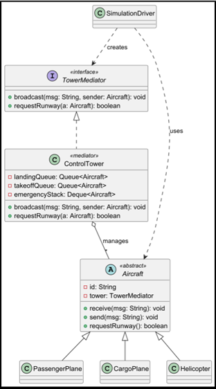

# homework
Part 1 – Iterator Pattern
“Streaming‑Service Binge Mode”

Overview

This example demonstrates the Iterator pattern in Java, modeling an episode player for a streaming service. A Series contains multiple Seasons, each storing episodes in its own way. A uniform EpisodeIterator interface allows clients to traverse episodes without knowing underlying storage.

Deliverables

Source code for all classes and iterators (in src/part1 directory).

Main demo (Streaming.java) showing each traversal mode.

This README explaining design decisions.

Why Iterator?

Encapsulation: Hides internal collections (ArrayList, LinkedList, lazy loader).

Flexibility: Supports multiple traversal strategies (normal, reverse, shuffle) with the same API.

Uniform API: UI code uses hasNext() / next() regardless of storage.

For-each Support: By making Season and Series implement Iterable<Episode>, we enable Java’s enhanced for-loop.

Composability: BingeIterator chains seasons into a single stream of episodes.

Run:

java -cp bin Streaming

Observe console output for:

Normal, reverse, and shuffle iteration of a single season.

Binge (normal) across all seasons.

Optional Extensions

Skip Intro Iterator: Wraps another iterator to start playback at offset n.

Watch History Filter: Decorator that filters out already-seen episodes.

Performance Report: Generate and time 10,000 fake episodes, printing an ASCII bar chart.

Part 2 – Mediator Pattern
“Airport Tower Simulator”
in src/part2/документация
